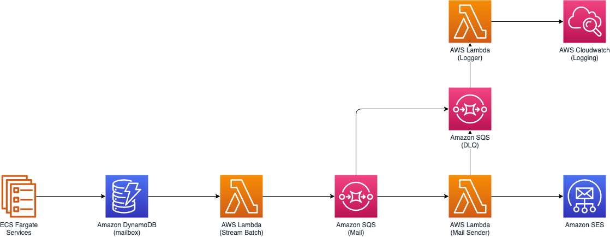

# Serverless Mailing Service on AWS

This repository is for tutorial of Serverless Mailing Service on AWS

Running this tutorial will provision below architecture on your AWS Account



and the give code is ready to extend to below architecture,


**Running this repository may cost you to provision AWS resources**

# Prerequisites

- awscli
- Nodejs 10.20+
- Python 3.7+
- AWS Account and Locally configured AWS credential

# Installation

Install project dependencies

```bash
$ cd infra
$ npm i
```

Install cdk in global context and run `cdk init` if you did not initailize cdk yet.

```bash
$ npm i -g cdk
$ cdk init
$ cdk bootstrap
```

Deploy CDK Stacks on AWS

```bash
$ cdk deploy "*" --require-approval never
```

# Usage

1. Verify your email on [**AWS SES Console**](https://console.aws.amazon.com/ses/home?region=ap-northeast-2#verified-senders-email:)

2. Modify *SENDER* varaible at [**mail-sender.py**](infra/functions/mail-sender.py) to your verified email.

3. Modify *records* variable at [**mail.py**](src/mail.py) to email address whatever you want to send.

**If you are not yet request increasing SES limitation, you can only send email to verified email.**

4. Run *mail.py*

```bash
$ python src/mail.py 
```

# Cleanup Resource

Remove all resources used in this tutorial.

```bash
$ cdk destroy "*"
```
